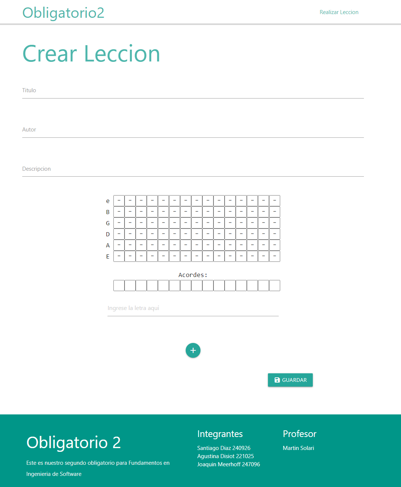
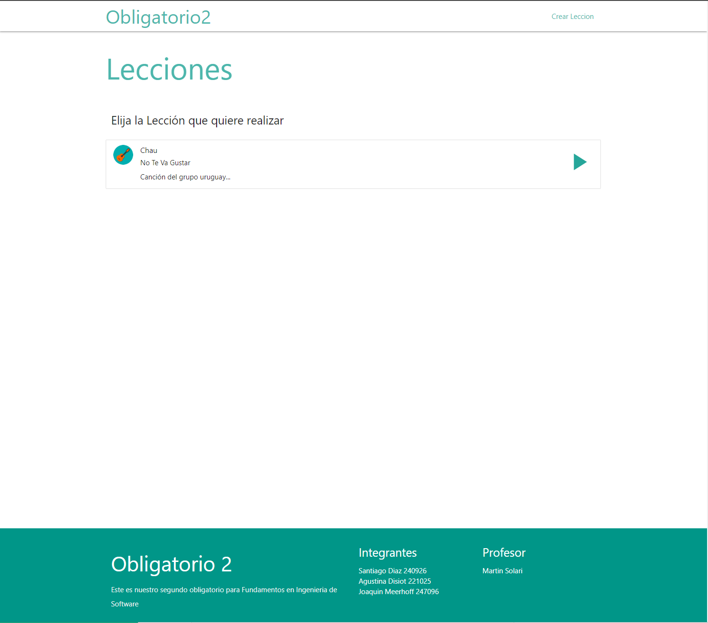
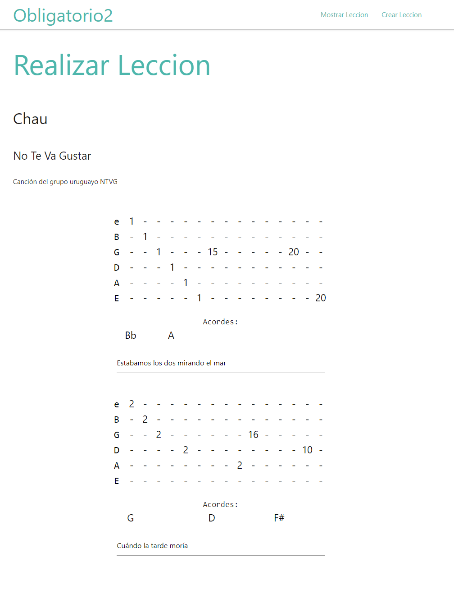
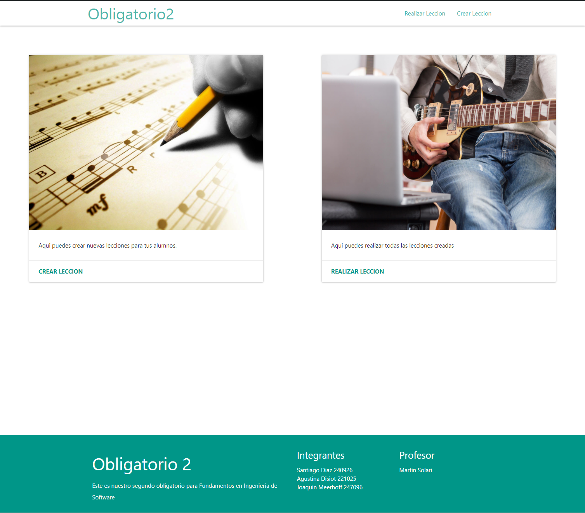

# Obligatorio 2 Fundamentos de Ingeniería en Sistemas

## Integrantes
- Santiago Díaz 240926
- Agustina Disiot 221025
- Joaquín Meerhoff 247096

### Link al repositorio: https://github.com/ORT-FIS-202008/ob2-diaz-disiot-meerhoff-1
(Los hipervínculos están escritos de forma relativa a la carpeta de github, si se usan en el archivo pdf, puede que no lleven a los archivos correctos).

---

## 0. Introducción al proyecto en general:

El proyecto del obligatorio 2, sobre enseñar el tocar guitarra a niños, lo realizamos utilizando varios tipos de tecnologías, como node.js, jest y materialize, que serán explicados en más detalle en sus categorías correspondientes.
Se fue tomando a medida que se realizó el proyecto un [informe general](./documentation/informeGeneral.md) que contiene las ideas, problemas y deciciones que se fueron tomando con el progreso del proyecto, y los diseños de estas ideas se anotaron en [Ideas_Iniciales](./documentation/Ideas_Iniciales.pdf). 

Otro documento que se utilizó fue el de [fuentes.md](./documentation/fuentes.md) donde se anotaron las principales fuentes o lugares de donde se extrajo código.
Esto no quita que en cada lugar donde se utilizó código 100% externo, se comento junto al código de donde provenía.

 

---

## 1. Calidad de código

En el obligatorio seguimos de base la style guide de google, para hacer una lista de reglas que nos comprometimos a seguir al escribir código. 
Estas reglas se encuentran dentro del archivo [calidadDeCodigo](./documentation/calidadDeCodigo.md) en la carpeta documentation.

Además a medida que fuimos trabajando en el proyecto, escribímos un [informe general](./documentation/informeGeneral.md) que contiene cronológicamente, las cosas en las que fuimos trabajando. Como por ejemplo, los problemas e intentos de usar material design.

Para facilitar el uso de estas reglas, utilizamos varios linters, ESLINT, JShint y Sonarlint. 
- ESLINT: Este linter lo utilizamos para mantener los espacios correctos entre métodos, además de controlar de no pasarse de 80 caracteres por columna (dejando 4 espacios de indentación en el caso que nos pasemos).
- JShint: Utilizamos principalmente los warnings de jshint, como variables no utilizadas, punto y comas faltantes y otros. 
- SonarLint: Nos recomendó cambios o errores posibles en el código, como notaciones más claras en algunas situaciones o errores que no siguen estándares de html.

Es importante mencionar, que utilizamos código de otras [fuentes](./documentation/fuentes.md), que en algunos casos lo usamos para comprender conceptos, mientras que en otros los usamos o bien de base, o para implementación de otras funcionalidades del programa. En casos en los que utilizamos funciones, nos aseguramos de que sigan nuestro estándar de codificación. Pero a fuentes que incluían archivos, como [un ejemplo de materialize](./src/interface/materialize.min.js), no fueron modificados, asi que no siguen nuestro estándar.

 

---

## 2. Prueba Unitaria

Al igual que fue demostrado en horario de clase, se realizaron pruebas unitarias con Jest, después de este ser instalado con npm de node.js .
Utilizamos el comando "npm test", que dentro de nuestro package.json esta definido el comando "jest --coverage" que indica la cobertura de las pruebas sobre las clases y funciones, además de la funcionalidad usual de jest de indicar si las pruebas son exitosas o no.

Para toda clase x en nuestro programa, hicimos un archivo x.test.js, para asegurarnos que su uso no lleve a errores inesperados.
Creamos nuestro propio archivo de [excepciones](./src/common/exceptions.js)
con excepciones como Exceptions.UNEXPECTED_VALUE para retornarlas cuándo no se reciben parámetros adecuados en los métodos de las clases.

Esto nos causo varios problemas a la hora de abrir el programa en un buscador, porque los métodos require y export utilizados en las clases no son reconocidos por javascript y no funcionan.

Consultamos en las ayudantías, y una de las soluciones que surgieron fue tener una copia de las clases que son utilizadas para las pruebas de jest, y una copia para el funcionamiento normal del programa.

Otra cosa que se nos dijo, y asi lo aplicamos, es que cuando estamos haciendo las pruebas a una funcion que llama a otras funciones, no es necesario repetir las pruebas. Esto es porque ya hicimos para las funciones llamadas sus pruebas y esto queda explicito. Por lo que comentamos debajo de dichas pruebas de lase funciones donde estarian el resto de las verificaciones. 

Por esto al correr npm run test, marca que el coverage no cubre todas las lineas de código, porque hay partes que llevan a otras funciones. 

Todo esto se menciona ya en los métodos, donde con un comentario se explica donde las pruebas restantes son completadas.

 

---
## 3. Interfaz de Usuario

En un principio, como fue mencionado en la introducción, se diseño diferentes interfaz a partir de ideas sobre en que dirección llevar el proyecto, y estas ideas se encuentran en [Ideas_Iniciales.pdf](./documentation/Ideas_Iniciales.pdf).
No consideramos que algunas de las ideas podían ser más díficiles de lo que nos plantemos, y por lo tanto varias de las propuestas no fueron trabajadas.

En el proyecto, se intento facilitar la usabilidad de la interfaz lo más posible, siguiendo por ejemplo, las heurísticas de nielsen.

### Heurísticas de Nielsen:

1. Visibilidad del estado del sistema: Cada vez que el usuario realiza una acción, se muestra por pantalla la reacción causada por esa acción. Por ejemplo, al ingresar datos incorrectos, se le avisa, o al cambiar de página, el título muestra el lugar en el que se encuentra el usuario.
2. Coincidencia entre sistema y mundo real: Usamos imágenes en el sistema para que el usuario entienda a que sección lo llevaría la página al tocar un botón. El vocabulario que usamos son las que un usuario que toca una guitarra podría entender.
3. Control y libertad del usuario: En toda página, está presente los controles de navegación para poder volver atrás a otra página sin perderse. 
4. Consistencia y estándares: Intentamos utilizar iconos en la interfaz que sean estandarizados, como el floppy disk de guardar, o el boton hamburguesa para abrir la barra de navegación, para que sea más rápido e intuitivo el uso de la página.
5. Prevención de error: Para evitarle problemas al usuario, consideramos que es necesario confirmar antes de guardar una lección, por si toco el botón por error, o si cambia de opinión.
6. Reconocer en vez de recordar: Para facilitarle al usuario el uso de la página, se le informa siempre de en donde se encuentra, y al abrir la página se le muestra con imágenes y texto las dos categorías principales a las que puede ir.
7. Flexibilidad y eficiencia de uso: La barra de navegación le brinda a los usuarios atajos en la interfaz para facilitar el movimiento entre las partes.
8. Estética y minimalismo: Para cumplir con el diseño miminalista y fácil de comprender, utilizamos [Materialize](https://materializecss.com/), especificamente el template [Parallax](https://materializecss.com/templates/parallax-template/preview.html).
9. Ayudar a los usuarios reconocer, diagnosticar y recuperarse de errores: En los inputs de crear lección, cada error tiene un mensaje específico, que por ejemplo, si se escribe un error en una cuerda, se le indica en que sección y cuerda es que esta el error.

### Crear Lección:

Vista en chrome:

La interfaz nuestra gira en torno a la creación de lecciónes, ya que por ahí es donde comenzamos la funcionalidad y el diseño, y por eso explicamos primero está parte, porque es necesaria para comprender el diseño de las otras. 
El Resultado de esta interfaz se encuentra en el archivo [crearLeccion.html](./src/scenes/crearLeccion.html), que contiene inputs para ingresar el nombre de la canción que se esta guardando, el título del autor, una descripción, y las distintas secciones. Estas secciones se refieren a un conjunto de tablatura, acordes y letra.

A pesar de tener integrantes que saben tocar instrumentos, lo vimos necesario investigar y definir los terminos previamente mencionados, además de otros para aclarar posible dudas:

- Definiciones:

  - Tablatura: Es una [notación musical simplificada que se basa en la representación de la posición de la nota en la cuerda o tecla del instrumento con que esta se toca.](https://www.google.com/search?q=definicion+tablatura&source=lmns&bih=1319&biw=1311&rlz=1C1GCEA_enUY797UY797&hl=en-US&sa=X&ved=2ahUKEwj9147gt5ntAhVACbkGHfLmCFkQ_AUoAHoECAEQAA) segun google.   En nuestro caso, la tablatura es una matriz, cuyo eje horizontal indica el avance del tiempo, y en su eje vertical tiene 6 espacios (uno para cada una de las cuerdas en una guitarra estándar). En cada uno de estos espacios se escribe que traste se debe estar tocando en la guitarra en ese debido momento.
  - Traste: Se encuentran en el mástil o cuello de la guitarra, están indicados por líneas perpendiculares a las cuerdas y dependiendo de cuál o cuales se esten presionando al tocar una o más cuerdas, se verá afectado el sonido resultante.
  - Acorde: Conjunto de notas que juntas forman una harmonía.
  - Nota: Sonido o frecuencia específica generada al tocar una cuerda (en una guitarra).
  - Letra: Sentencia asociada a un conjunto de acordes o una tablatura en especifico.
  - Sección: En nuestro proyecto, nos referimos a sección a un conjunto de tablatura, letra y acorde, aunque en caso de tener letra y/o acordes vacíos, a estos no se los muestra al realizar una lección, pero si a la tablatura. Esto es porque el programa se enfoca en la guitarra y no en el área de la letra.
  - Lección: Un conjunto de secciones que contiene necesariamente un título, pero también puede contener un autor y descripción. 

Se mencionó en las definiciones que se trabaja con 6 cuerdas, pero en un comienzo no estabamos seguros de si esto podría llegar a cambiar.
Variables como la cantidad de cuerda, cantidad de trastes, u otros fueron definidos en un archivo [definiciones.js](./src/common/definiciones.js) que es referenciado en todas las clases del sistema, y su uso permitía poder modificar esta variable desde un solo lugar.

Las pautas para crear una lección son las siguientes:

- El título es necesario para que los usarios que quieren realizar una lección puedan distinguir una entre las otras. Como pueden haber dos canciones o lecciones que se quisiera tener bajo un mismo título, esto no se limita.
- El autor y descripción no son campos obligatorios ya que puede ser anónimo o desconocido el autor, y por el lado de la descripción, puede que el creador de la lección no encuentre necesario el escribirla.
- Las letras pueden quedar vacíos, como fue mencionado previamente. Las letras pueden incluir cualquier caracter y pueden ser de cualquier largo.
- Los acordes también pueden quedar vacíos, pero no pueden incluir números, ni pueden ser mayores a 3 caracteres de largo. 
- La tablatura puede quedar vacía tambien, pero a diferencia de los acordes y letras, al ser realizada, siempre se muestra. Las limitaciones de la tablatura son que los inputs solo aceptan números, y da un error si el número es mayor a 25 o menor a 0.
- Se tiene un botón para agregar más secciones, que al ser presionado la agrega vacía al final.
- Se tiene un botón para guardar que en el caso de no cumplir las pautas previas, muestra por pantalla donde esta el error a través de un ["Toast"](https://materializecss.com/toasts.html) de materialize, que es un mensaje en un cuadro rectangular que desaparece al pasar un determinado tiempo.
- Al guardarse efectivamente, aparece un ["Modal"](https://materializecss.com/modals.html) y se da la opción de crear otra lección o ir a la lista de lecciones.

### Mostrar Lección

Vista en chrome:

En esta parte de la página, se representan todas las lecciones que hayan sido creadas. En el caso del sistema estar vacío, se le informa al usuario y se le ofrece volver al inicio o crear una lección (Esto se puede probar con modo incógnito).

El uso de esta parte es para llevar a un usuario a la lección que quiere realizar. A la derecha de cada lección, se muestra un botón de play para realizarla, el cual al apretarlo, lleva directamente a la lección.

### Realizar Lección

Vista en chrome:

Esta parte de la página es utilizada para visualizar una lección que haya sido guardada en el sistema. Para llegar aquí, se debe necesariamente haber creado una lección, además de haber pasado por mostrar Lecciones, donde se eligió la leccion a mostrar.

La forma en la que se representa, es a partir de las mismas estructuras con las cuales se hizo el crearLección, sólo que ya no se puede ni escribir, ni borrar los datos de los inputs. 

Aquí el usuario práctica la lección todas las veces que quiere, y después puede volver atrás a partir del menú de navegación.

### Menu Inicial

Vista en chrome:

Esta es la pantalla de inicio de la página, y le brinda al usuario dos opciones principales (sin incluir el menú de navegación).

Estas dos opciones sirven para explicarle al usuario las dos acciones que puede hacer. 

Estas son: 
  - Crear una lección
  - Realizar una lección

 

---
## 4. Construcción

Para poder tener la página andando, se deben seguir los siguientes pasos:

1. Tener instalado node.js en una versión estable, porque se requiere npm.
2. Copiar el repositorio de github en un directorio local con el commando: "git clone https://github.com/ORT-FIS-202008/ob2-diaz-disiot-meerhoff-1.git"
3. Luego se debe ejecutar el comando "npm install" en el directorio donde se encuentre el root del repositorio para instalar todas las dependencias del proyecto.

Habiendo seguido estos pasos, se puede:

- Abrir directamente el index.html para abrir la página.
- Ejecutar el comando "npm run test" en el directorio para realizar las pruebas unitarias de jest, que incluyen el cubrimiento.

## 5. Testing funcional

Para testing funcional realizamos casos de prueba además de pruebas exploratorias. Además hicimos una prueba de [caja negra para crear lección](./documentation/PruebasCajaNegra/pruebasCrearLeccion.md).

Las pruebas exploratorias las anotamos en una [lista](./documentation/PruebasExploratorias/listaPruebasExploratorias/README.md#Lista-de-pruebas-exploratorias:) que contiene los títulos, tester y más información además de un link a la prueba en si.

Estas pruebas fueron hechas a partir de un [template dado por los docentes.](./documentation/PruebasExploratorias/templateExploratorio.md).

## 6. Reporte de defectos

Una vez que la mayoría de la funcionalidad de la página quedo andando y comenzamos a hacer testing funcional, empezamos a registrar issues con las herramientas de github. Algunos pudimos [cerrarlos](https://github.com/ORT-FIS-202008/ob2-diaz-disiot-meerhoff-1/issues?q=is%3Aissue+is%3Aclosed) mientras que otros quedaron [abiertos](https://github.com/ORT-FIS-202008/ob2-diaz-disiot-meerhoff-1/issues).

También utilizamos un [template para los issues](./documentation/templateIssue.md) para facilitar el reportarlos y marcarlos como corregidos.

A pesar de haber intentado manener el software sin bugs en el desarrollo, por temas de tiempo se tuvo que priorizar algunos bugs que rompen el sistema antes que otros, y esto llevo a que algunos sigan abiertos. 

## 7. Trabajo Individual

### Santiago Diaz
Calidad de código:
  - A la hora de establecer un estándar de código Santiago se juntó con el equipo y se decidió entre todos seguir el estándar de Google. 
  - Al igual que los demás, instaló los linters utilizados en el proyecto, y además configuró el workspace para seguir las reglas indentación.
  - Contribuyó con el grupo para hacer la documentación de los estilos de codificación usados.
Prueba unitaria:
  - Hizo las la mayoría de las pruebas unitarias para las clases de:
    - Tablatura.
    - Seccion.
    - Leccion.
    - Sistema.
    - Interfaz de usuario
Interfaz de usuario: 
  - Creó el primer diseño de Crear Lección que tenía solo html.
  - Mientras hacía las pruebas unitarias verificó, creó y corrigió todos los métodos de las clases mencionadas. 
  - Cuando el equipo decidió usar Materialize el se encargo de:
    - Crear en su totalidad el html y el css del menú inicial.
    - Agregar todos los links a la barra de navegación y arreglar su css en todas las secciones de la página.
    - Crear y adaptar correctamente el footer en todas las secciones de la página.
  - Justo con sus compañeros arreglar el css de Crear Lección, y la lista de lecciones.
  - Arreglar el html y css del modal de Crear Lección.
Testing funcional:
  - Se encargó de hacer la prueba de caja negra de la sección Crear Leccion de la página.
  - Se encargó de hacer una prueba exploratoria de la funcionalidad de la barra de navegación de todo el sistema, tanto para modo desktop como para modo celular.
Reporte de defectos:
  - A partir de la prueba de caja negra realizada Santiago pudo encontrar dos defectos con el sistema.
  - Al ingresar un acorde no válido en vez de saltar un toasts saltaba un alert (este issue fue reportado y solucionado).
  - Al ingresar un acorde de tres letras se tomaba como no válido (este issue fue reportado).
  - Genero el issue del menu de hamburguesa al cambiar de resolucion.

### Agustina Disiot
Calidad de código: 
- Agustina se juntó con el equipo entero para definir el estándar de código a utilizar en todo el proyecto. Esto incluye la investigación de las style guides de google para indentación de archivos JavaScript y HTML.
  - Al igual que los demás, instaló los linters utilizados en el proyecto, y además configuró el workspace para seguir las reglas indentación.
  - Contribuyó con el grupo para hacer la documentación de los estilos de codificación usados.
Prueba unitaria:
  - Agustina se encargó de hacer algunas de las pruebas Jest para la clase tablatura y sección
Interfaz de Usuario: 
  - Agustina se encargó de codificar la mayor parte de los métodos de la clase lección.js y sistema.js 
  - Codificación de métodos que verifican la validez de los campos HTML y métodos que se utilizan para hacer las pruebas Jest.
  - Codificó gran parte de los métodos:
    - agregarSeccion, que después de verificar que este correcta, la agrega a la lista de secciones de una lección
    - verificarTitulo
    - verificarAutor
    - verificarDesc
    - verificarSeccion, verifica que los datos de la sección estén correctos, como el título, autor y su descripción
    - darLeccion, que devuelve la lección dada la posición en el array
    - verificarLeccion, verifica que todas las secciones de lección estén correctas
    - agregarLeccion, que agrega, después de verificar, la lección al sistema
Cuando el equipo decidió usar Materialize:
  - Investigo sobre componentes que se podían utilizar para la página.
  - Creó el primer diseño de Mostrar Lecciones con estilos de Materialize
Testing Funcional:
  - Realizo pruebas exploratorias para windows 10, con especificaciones para celulares.
  - Realizó algunas pruebas exploratorias para todas las páginas, esto incluye la página de inicio, mostrar lecciones, crear lección y realizar lección.
  - Realizo pruebas exploratorias para verificar la precisión de los errores al crear lección.
Reporte de defectos:
  - A partir de las pruebas exploratorias realizadas, generó issues con las herramientas de github. En estas hay screenshots de los defectos, algunos de estos quedaran sin resolver

### Joaquin Meerhoff
Calidad de código
  - Al igual que los demás, instaló los linters utilizados en el proyecto, y además configuró el workspace para seguir las reglas indentación.
  - Contribuyó con el grupo para hacer la documentación de los estilos de codificación usados.
Prueba unitaria
  - Incluyó los export y requiere para las pruebas jest e hizo la instalación de Jest junto al equipo.
  - Realizó algunas pruebas de la clase tablatura y sección. 
Interfaz de Usuario
  - Codificó la mayor parte de los métodos:
    - crearSeccion, que crea inputs en js y los agrega al html para ingresar tablatura, acorde y letra.
    - agregarLeccion (para html) que permite agregar una sección más para crear lección desde html.
    - guardarLeccion que copia los valores de los inputs de las secciones, además de título, autor y descripción de la lección en el sistema.
    - mostrarLección, que toma la lista de lecciones del sistema y las muestra en html en el template de materialize.
    - levantarSistema y guardarSistema, se encargan de guardar y cargar del localStorage del buscador, el sistema con lecciones, tablaturas, acordes, letras, etc. Se persiste esta información para poder trabajar en distintas ventanas y compartir el mismo sistema.
    - guardarLeccion (para html) para guardar la lección que se acaba de elegir desde el html.
Cuando el equipo decidió usar Materialize:
  - Modificó los métodos que crean componentes de html para que sigan el nuevo estilo de interfaz.
  - Ayudó para los "Modals" o mensajes de avisos en crear lección para que cuando un usuario guarda una lección, confirme que quiere continuar.

Testing funcional
  - Realizó pruebas exploratorias en windows 10 además de en Mac, para probar la compatibilidad con otros sistemas operativos.
  - Probó la compatibilidad en los buscadores Chrome y Safari.

Reporte de defectos
  - A partir de las pruebas exploratorias realizadas, generó issues con las herramientas de github y resolvió parte de estos, como alerts en la página que habían quedado de la fase de desarrollo temprano.

## 8. Defensa

### Git:

A medida que fuimos trabajando con git fuimos aprendiendo cuales son malas y buenas prácticas de la herramienta. Por ejemplo, en un principio por miedo a tener problemas con merge conflicts, intentamos evitar problemas de uno escribir sobre lo de los demás. Pero después de que nos pasó una vez, empezamos a no preocuparnos tanto por eso.

La forma en la que trabajamos con las ramas fue: intentar de que cada rama implicara solamente un cambio especifico al repositorio, para poder en la vista de [network](https://github.com/ORT-FIS-202008/ob2-diaz-disiot-meerhoff-1/network) comprender fácilmente en que trabajo cada uno de los integrantes, además de ver como iban progresando las diferentes áreas del proyecto.

Aquí surgen las ramas principales:

- testing: Una rama que a medida que se completaban funcionalidades en su totalidad, las agregamos a esta rama.

- avancesSistema: Esta rama se enfocó principalmente en la parte de las clases de javascript, que podría decirse la rama de "Back-end". A esta se le fue agregando lo que ramas más chicas avanzaban para agregarle.
- avancesInterfaz: Esta rama se enfoco principalmente en la parte visual del proyecto, o sea, crear componentes javascript y las interacciones con el usuario. Esta sería entonces la rama "Front-End".
- pruebaJest: Esta rama se encargaba de las pruebas unitarias de Jest, para tener a parte las clases con los require y export no comentados.
- testingExploratorio: La mayoría de las pruebas exploratorias se realiaron en esta rama, para tener un repositorio estático durante la prueba.

Hay más ramas, pero muchas de ellas solamente agregaban una funcionalidad específica o solucionaban un bug, como la de hotFixGuardar.

Probablemente iríamos borrando las ramas que ya no se usen, pero para que quede el registro en la entrega, no fueron borradas. Notamos que la presencia de tantas ramas hizo difícil la lectura al hacer "git branch -a" y querer ver que ramas estan activas.

Estas ramas fueron realizando merge entre ellas porque preciban funciones o clases de las otras, como pruebaJest precisaba las clases de avancesSistema.

 

### Aprendido

En comparación al obligatorio anterior, se trabajó de forma mucho más individual asignando tareas específicas a cada integrante del equipo, esto hizo que el trabajo en paralelo fuera más rápido y eficiente con el tiempo.

Creemos que deberíamos no haber creado quizas tantas ramas porque esto llevó a confusiones a lo largo del proyecto.

También creemos que nos enfocamos demasiado en material design en un comienzo, y esto nos quitó mucho tiempo, porque no logramos hacerlo funcionar, pero no investigamos otras alternativas hasta tener ya poco tiempo. De todos modos, logramos utilizar Materialize y creemos que esta herramienta externa nos ayudó mucho en el diseño, ya que solo con css y html no podríamos haber creado algo del estilo.

Sobre el tema de investigar, creemos que no solo para la interfaz pero en general, se debería haber investigado más tecnologías actuales, porque puede que existan ya herramientas y quizas su implementación podría ahorrarnos tiempo y problemas.

